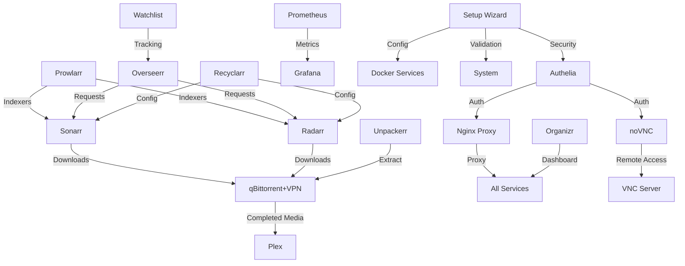

# 🎬 Monsterr Media Server

Take control of your digital media and protect your privacy with Monsterr Media Server. This comprehensive Docker-based solution puts you in charge of your entertainment without compromising security.

Built with a security-first approach, Monsterr provides:

*   🔒 Complete data privacy - your media stays under your control.
*   🛡️ Enterprise-grade security with two-factor authentication and Fail2ban protection.
*   🌐 Secure remote access with VPN integration.
*   📊 Real-time monitoring dashboard with WebSocket updates.
*   🔔 Comprehensive alert management system.
*   📈 Resource utilization tracking and visualization.
*   🎯 Automated media management with granular access controls.

Perfect for privacy-conscious users who want a secure, self-hosted alternative to traditional streaming services.

## Features

*   🎬 Complete media server stack (Plex, Sonarr, Radarr, etc.)
*   🔒 Secure authentication with Authelia
*   🔄 Automated content management
*   📊 Real-time system monitoring dashboard
*   🔔 WebSocket-based live updates
*   📈 Resource utilization visualization
*   🚨 Configurable alert management
*   🛠️ Enhanced React-based setup wizard
*   🚀 Docker-based deployment
*   📱 Mobile-friendly interface
*   🔐 VPN integration for downloads
*   ✨ Real-time system validation
*   🔍 Service dependency management
*   💾 Automated storage configuration
*   🌐 Streamlined network setup
*   🖥️ Secure remote desktop access (VNC)
*   📋 Unified dashboard with Organizr
*   🎯 Media request management with Overseerr
*   📝 Watchlist integration
*   ⚙️ Advanced configuration tools (Recyclarr)
*   📦 Automated extraction (Unpackerr)

## Quick Start

1.  **Clone the Repository:**

    ```bash
    git clone [repository-url]
    cd monsterr-media-server
    ```

2.  **Run the Installer:**

    ```bash
    sudo ./install_media_server.sh
    ```

3.  **Access the Setup Wizard:** The React-based setup wizard will automatically launch in your browser, guiding you through:
    *   System requirements validation
    *   Service selection with dependency management
    *   Storage path configuration and validation
    *   Network and domain setup
    *   Security configuration
    *   Final review and deployment

For detailed instructions, see our [Installation Guide](docs/guides/installation.md).

## System Requirements

### Minimum Requirements

*   CPU: 4 cores
*   RAM: 8GB
*   Storage: 20GB + media storage
*   OS: Ubuntu 20.04+ or similar
*   Docker & Docker Compose
*   Node.js 18.0.0+ (for setup wizard)

### Recommended

*   CPU: 6+ cores
*   RAM: 16GB+
*   Storage: SSD for system, HDD for media
*   Gigabit network connection

See the [Hardware Guide](docs/guides/hardware.md) for detailed recommendations.

## Core Services

### Infrastructure Services

#### Nginx Proxy Manager

*   **Purpose:** Reverse proxy for service access and SSL termination
*   **Dependencies:** None
*   **Ports:** 80, 443 (HTTP/HTTPS), 81 (Admin)
*   **Configuration:** `/config/nginx/`
*   **Key Features:**
    *   SSL certificate management
    *   Access control
    *   Custom host configurations

#### Authelia

*   **Purpose:** Multi-factor authentication and SSO
*   **Dependencies:** Redis
*   **Ports:** Internal only
*   **Configuration:** `/config/authelia/`
*   **Key Features:**
    *   Two-factor authentication
    *   Single sign-on
    *   Access control rules

### Media Services

#### Plex Media Server

*   **Purpose:** Media streaming and organization
*   **Dependencies:** None
*   **Port:** 32400
*   **Configuration:** `/config/plex/`
*   **Environment Variables:**
    *   `PLEX_CLAIM`: Plex claim token
    *   `PUID/PGID`: User/Group IDs
*   **Media Paths:**
    *   `/media/movies`: Movies library
    *   `/media/tv`: TV shows library
    *   `/media/music`: Music library

#### Sonarr (TV Shows)

*   **Purpose:** TV show management and downloads
*   **Dependencies:** Prowlarr, qBittorrent/NZBGet
*   **Port:** 8989
*   **Configuration:** `/config/sonarr/`
*   **API:** `http://sonarr:8989/api/v3`
*   **Integration Points:**
    *   Connects to Prowlarr for indexers
    *   Uses qBittorrent/NZBGet for downloads
    *   Integrates with Plex for library updates

#### Radarr (Movies)

*   **Purpose:** Movie management and downloads
*   **Dependencies:** Prowlarr, qBittorrent/NZBGet
*   **Port:** 7878
*   **Configuration:** `/config/radarr/`
*   **API:** `http://radarr:7878/api/v3`
*   **Integration Points:**
    *   Connects to Prowlarr for indexers
    *   Uses qBittorrent/NZBGet for downloads
    *   Integrates with Plex for library updates

### Download Management

#### qBittorrent with VPN

*   **Purpose:** Torrent client with VPN protection
*   **Dependencies:** VPN service
*   **Port:** 8080
*   **Configuration:** `/config/qbittorrent/`
*   **Environment Variables:**
    *   `VPN_PROVIDER`: VPN service name
    *   `VPN_USERNAME/VPN_PASSWORD`: VPN credentials
*   **Security Features:**
    *   Kill switch
    *   IP leak protection
    *   Port forwarding

#### Prowlarr

*   **Purpose:** Indexer management
*   **Dependencies:** None
*   **Port:** 9696
*   **Configuration:** `/config/prowlarr/`
*   **API:** `http://prowlarr:9696/api/v1`
*   **Integration Points:**
    *   Provides indexers to Sonarr/Radarr
    *   Manages API keys and credentials

### Monitoring & Management

#### System Dashboard

*   **Purpose:** Real-time system monitoring
*   **Dependencies:** None
*   **Port:** 3000
*   **Configuration:** `/config/dashboard/`
*   **Key Features:**
    *   Real-time resource monitoring
    *   WebSocket-based updates
    *   Service health tracking
    *   Alert management
    *   Performance visualization
    *   Historical metrics

#### Prometheus

*   **Purpose:** Metrics collection
*   **Dependencies:** None
*   **Port:** 9090
*   **Configuration:** `/config/prometheus/`
*   **Key Metrics:**
    *   System resources
    *   Container stats
    *   Service health
    *   Network performance
    *   Storage utilization

#### Grafana

*   **Purpose:** Advanced metrics visualization
*   **Dependencies:** Prometheus
*   **Port:** 3001
*   **Configuration:** `/config/grafana/`
*   **Environment Variables:**
    *   `GF_SECURITY_ADMIN_PASSWORD`: Admin password
*   **Features:**
    *   Custom dashboards
    *   Advanced analytics
    *   Alert correlation
    *   Data visualization
    *   Trend analysis

### Book & Audio Management

#### Audiobookshelf

*   **Purpose:** Audiobook and podcast server
*   **Dependencies:** None
*   **Port:** 13378
*   **Configuration:** `/config/audiobookshelf/`
*   **Media Paths:**
    *   `/media/audiobooks`: Audiobook library
    *   `/media/podcasts`: Podcast storage

#### Calibre-Web

*   **Purpose:** Ebook management and reading
*   **Dependencies:** None
*   **Ports:** Internal only
*   **Configuration:** `/config/calibre-web/`
*   **Media Path:** `/media/ebooks`

### UI Services

#### Organizr

*   **Purpose:** Unified service dashboard
*   **Dependencies:** None
*   **Ports:** Internal only
*   **Configuration:** `/config/organizr/`
*   **Key Features:**
    *   Service organization
    *   Tab-based interface
    *   Custom theming

#### Overseerr

*   **Purpose:** Media request management
*   **Dependencies:** Plex
*   **Ports:** Internal only
*   **Configuration:** `/config/overseerr/`
*   **Key Features:**
    *   Request tracking
    *   User management
    *   Automatic routing to Sonarr/Radarr

#### Watchlist

*   **Purpose:** Media watchlist management
*   **Dependencies:** None
*   **Ports:** Internal only
*   **Configuration:** `/config/watchlist/`
*   **Key Features:**
    *   Personal watchlists
    *   Integration with request system
    *   Progress tracking

### Utility Services

#### Recyclarr

*   **Purpose:** Configuration management
*   **Dependencies:** Radarr, Sonarr
*   **Ports:** Internal only
*   **Configuration:** `/config/recyclarr/`
*   **Key Features:**
    *   Automated configuration
    *   Profile management
    *   Quality settings sync

#### Unpackerr

*   **Purpose:** Automated extraction
*   **Dependencies:** None
*   **Ports:** Internal only
*   **Configuration:** `/config/unpackerr/`
*   **Key Features:**
    *   Archive extraction
    *   Cleanup operations
    *   Error handling

## Service Interactions



## Environment Variables

Core environment variables required for setup:

```bash
# User/Group IDs
PUID=1000
PGID=1000

# Timezone
TZ=America/New_York

# Paths
MEDIA_DIR=/path/to/media
DOWNLOADS_DIR=/path/to/downloads

# Security
GRAFANA_ADMIN_PASSWORD=secure_password
VPN_USERNAME=vpn_user
VPN_PASSWORD=vpn_pass

# API Keys
PLEX_CLAIM=claim-xxxxx
SONARR_API_KEY=xxxxx
RADARR_API_KEY=xxxxx
```

See the [Configuration Guide](docs/guides/configuration.md) for a complete list.

## Documentation

*   [Installation Guide](docs/guides/installation.md)
*   [Configuration Guide](docs/guides/configuration.md)
*   [Domain Setup Guide](docs/guides/domain-setup.md)
*   [Network Setup Guide](docs/guides/network-setup.md)
*   [Troubleshooting Guide](docs/guides/troubleshooting.md)
*   [Architecture Overview](docs/api/architecture.md)
*   [API Documentation](docs/api/api.md)
*   [Security Guide](docs/guides/security.md)
*   [Monitoring Guide](docs/guides/monitoring.md)
*   [Backup Guide](docs/guides/backup.md)
*   [Development Guide](docs/guides/development.md)

## Project Structure

```
/
├── config/                    # Configuration files
│   ├── authelia/             # Authelia config
│   ├── docker/               # Docker compose files
│   ├── nginx/                # Nginx config
│   └── services/             # Service configs
├── docs/                      # Documentation
│   ├── assets/               # Images, diagrams
│   ├── guides/               # User guides
│   └── api/                  # API documentation
├── scripts/                   # Shell scripts
│   ├── install/              # Installation scripts
│   ├── maintenance/          # Maintenance scripts
│   └── utils/                # Utility scripts
├── src/                      # Source code
│   └── web_interface/        # Web UI code
│       ├── dashboard/        # Dashboard components
│       ├── setup/           # Setup wizard components
│       └── shared/          # Shared components
├── tests/                    # Test files
│   ├── integration/         # Integration tests
│   └── unit/               # Unit tests
└── tools/                    # Development tools
```

## Contributing

We welcome contributions! Please see our [Contributing Guide](CONTRIBUTING.md) for details.

### Development Setup

1.  **Install Dependencies:**

    ```bash
    # Install system dependencies
    sudo ./scripts/install/install_dependencies.sh

    # Install web interface dependencies
    cd src/web_interface
    npm install
    ```

2.  **Start Development Server:**

    ```bash
    # Start the setup wizard development server
    npm run dev

    # Start the setup API server
    npm run setup
    ```

3.  **Run Tests:**

    ```bash
    npm test
    ```

See the [Development Guide](docs/guides/development.md) for more details.


## Support

If you encounter any issues:

1.  Check the [Troubleshooting Guide](docs/guides/troubleshooting.md).
2.  Run the debug collection tool:

    ```bash
    sudo ./scripts/utils/collect_debug_info.sh
    ```

3.  Contact the project maintainers with the debug information.

## Security

*   All services are protected by Authelia 2FA.
*   Fail2Ban integration for brute-force protection.
*   VPN support for anonymous downloads.
*   Regular security updates via Watchtower.
*   SSL/TLS encryption for all services.
*   Network isolation for sensitive services.
*   Real-time security configuration validation.

See the [Security Guide](docs/guides/security.md) for details.

## License

This project is licensed under the MIT License - see the [LICENSE](LICENSE) file for details.

## Acknowledgments

*   All the amazing open-source projects that make this possible
*   The community for their feedback and contributions
*   [Docker](https://www.docker.com/) for containerization
*   [Plex](https://www.plex.tv/) for media streaming
*   [Authelia](https://www.authelia.com/) for authentication
*   [React](https://reactjs.org/) for the setup wizard interface
*   [Material-UI](https://mui.com/) for UI components
