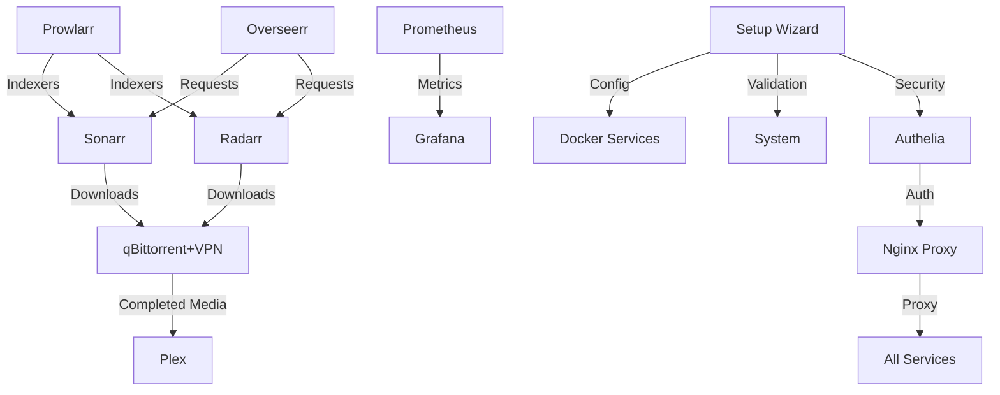

# Monsterr Media Server

A comprehensive, Docker-based media server solution with automated management and a user-friendly web interface.

## Features

- 🎬 Complete media server stack (Plex, Sonarr, Radarr, etc.)
- 🔒 Secure authentication with Authelia
- 🔄 Automated content management
- 📊 System monitoring and notifications
- 🛠️ Enhanced React-based setup wizard
- 🚀 Docker-based deployment
- 📱 Mobile-friendly interface
- 🔐 VPN integration for downloads
- ✨ Real-time system validation
- 🔍 Service dependency management
- 💾 Automated storage configuration
- 🌐 Streamlined network setup

## Quick Start

1. **Clone the repository**
```bash
git clone [repository-url]
cd monsterr-media-server
```

2. **Run the installer**
```bash
sudo ./install_media_server.sh
```

3. **Access the Setup Wizard**
The new React-based setup wizard will automatically launch in your browser, guiding you through:
- System requirements validation
- Service selection with dependency management
- Storage path configuration and validation
- Network and domain setup
- Security configuration
- Final review and deployment

For detailed instructions, see our [Installation Guide](docs/guides/installation.md).

## System Requirements

### Minimum Requirements
- CPU: 4 cores
- RAM: 8GB
- Storage: 20GB + media storage
- OS: Ubuntu 20.04+ or similar
- Docker & Docker Compose
- Node.js 18.0.0+ (for setup wizard)

### Recommended
- CPU: 6+ cores
- RAM: 16GB+
- Storage: SSD for system, HDD for media
- Gigabit network connection

See [Hardware Guide](docs/guides/hardware.md) for detailed recommendations.

## Core Services

### Infrastructure Services

#### Nginx Proxy Manager
- **Purpose**: Reverse proxy for service access and SSL termination
- **Dependencies**: None
- **Port**: 80, 443 (HTTP/HTTPS), 81 (Admin)
- **Configuration**: `/config/nginx/`
- **Key Features**:
  * SSL certificate management
  * Access control
  * Custom host configurations

#### Authelia
- **Purpose**: Multi-factor authentication and SSO
- **Dependencies**: Redis
- **Port**: Internal only
- **Configuration**: `/config/authelia/`
- **Key Features**:
  * Two-factor authentication
  * Single sign-on
  * Access control rules

### Media Services

#### Plex Media Server
- **Purpose**: Media streaming and organization
- **Dependencies**: None
- **Port**: 32400
- **Configuration**: `/config/plex/`
- **Environment Variables**:
  * `PLEX_CLAIM`: Plex claim token
  * `PUID/PGID`: User/Group IDs
- **Media Paths**:
  * `/media/movies`: Movies library
  * `/media/tv`: TV shows library
  * `/media/music`: Music library

#### Sonarr (TV Shows)
- **Purpose**: TV show management and downloads
- **Dependencies**: Prowlarr, qBittorrent/NZBGet
- **Port**: 8989
- **Configuration**: `/config/sonarr/`
- **API**: `http://sonarr:8989/api/v3`
- **Integration Points**:
  * Connects to Prowlarr for indexers
  * Uses qBittorrent/NZBGet for downloads
  * Integrates with Plex for library updates

#### Radarr (Movies)
- **Purpose**: Movie management and downloads
- **Dependencies**: Prowlarr, qBittorrent/NZBGet
- **Port**: 7878
- **Configuration**: `/config/radarr/`
- **API**: `http://radarr:7878/api/v3`
- **Integration Points**:
  * Connects to Prowlarr for indexers
  * Uses qBittorrent/NZBGet for downloads
  * Integrates with Plex for library updates

### Download Management

#### qBittorrent with VPN
- **Purpose**: Torrent client with VPN protection
- **Dependencies**: VPN service
- **Port**: 8080
- **Configuration**: `/config/qbittorrent/`
- **Environment Variables**:
  * `VPN_PROVIDER`: VPN service name
  * `VPN_USERNAME/VPN_PASSWORD`: VPN credentials
- **Security Features**:
  * Kill switch
  * IP leak protection
  * Port forwarding

#### Prowlarr
- **Purpose**: Indexer management
- **Dependencies**: None
- **Port**: 9696
- **Configuration**: `/config/prowlarr/`
- **API**: `http://prowlarr:9696/api/v1`
- **Integration Points**:
  * Provides indexers to Sonarr/Radarr
  * Manages API keys and credentials

### Monitoring & Management

#### Prometheus
- **Purpose**: Metrics collection
- **Dependencies**: None
- **Port**: 9090
- **Configuration**: `/config/prometheus/`
- **Key Metrics**:
  * System resources
  * Container stats
  * Service health

#### Grafana
- **Purpose**: Metrics visualization
- **Dependencies**: Prometheus
- **Port**: 3000
- **Configuration**: `/config/grafana/`
- **Environment Variables**:
  * `GF_SECURITY_ADMIN_PASSWORD`: Admin password
- **Features**:
  * Custom dashboards
  * Alert management
  * Data visualization

### Book & Audio Management

#### Audiobookshelf
- **Purpose**: Audiobook and podcast server
- **Dependencies**: None
- **Port**: 13378
- **Configuration**: `/config/audiobookshelf/`
- **Media Paths**:
  * `/media/audiobooks`: Audiobook library
  * `/media/podcasts`: Podcast storage

#### Calibre-Web
- **Purpose**: Ebook management and reading
- **Dependencies**: None
- **Port**: Internal only
- **Configuration**: `/config/calibre-web/`
- **Media Path**: `/media/ebooks`

## Service Interactions



## Environment Variables

Core environment variables required for setup:
```bash
# User/Group IDs
PUID=1000
PGID=1000

# Timezone
TZ=America/New_York

# Paths
MEDIA_DIR=/path/to/media
DOWNLOADS_DIR=/path/to/downloads

# Security
GRAFANA_ADMIN_PASSWORD=secure_password
VPN_USERNAME=vpn_user
VPN_PASSWORD=vpn_pass

# API Keys
PLEX_CLAIM=claim-xxxxx
SONARR_API_KEY=xxxxx
RADARR_API_KEY=xxxxx
```

See [Configuration Guide](docs/guides/configuration.md) for a complete list.

## Documentation

### User Guides
- [Quick Start Guide](docs/guides/quick-start.md)
- [Installation Guide](docs/guides/installation.md)
- [Configuration Guide](docs/guides/configuration.md)
- [Domain Setup Guide](docs/guides/domain-setup.md)
- [Network Setup Guide](docs/guides/network-setup.md)
- [Troubleshooting Guide](docs/guides/troubleshooting.md)

### Technical Documentation
- [Architecture Overview](docs/api/architecture.md)
- [API Documentation](docs/api/api.md)
- [Security Guide](docs/guides/security.md)
- [Monitoring Guide](docs/guides/monitoring.md)
- [Backup Guide](docs/guides/backup.md)

## Project Structure

```
/
├── config/                    # Configuration files
│   ├── authelia/             # Authelia config
│   ├── docker/               # Docker compose files
│   ├── nginx/                # Nginx config
│   └── services/             # Service configs
├── docs/                      # Documentation
│   ├── assets/               # Images, diagrams
│   ├── guides/               # User guides
│   └── api/                  # API documentation
├── scripts/                   # Shell scripts
│   ├── install/              # Installation scripts
│   ├── maintenance/          # Maintenance scripts
│   └── utils/                # Utility scripts
├── src/                      # Source code
│   └── web_interface/        # Web UI code
│       ├── dashboard/        # Dashboard components
│       ├── setup/           # Setup wizard components
│       └── shared/          # Shared components
├── tests/                    # Test files
│   ├── integration/         # Integration tests
│   └── unit/               # Unit tests
└── tools/                    # Development tools
```

## Contributing

We welcome contributions! Please see our [Contributing Guide](CONTRIBUTING.md) for details.

### Development Setup

1. **Install dependencies**
```bash
# Install system dependencies
sudo ./scripts/install/install_dependencies.sh

# Install web interface dependencies
cd src/web_interface
npm install
```

2. **Start development server**
```bash
# Start the setup wizard development server
npm run dev

# Start the setup API server
npm run setup
```

3. **Run tests**
```bash
npm test
```

See [Development Guide](docs/guides/development.md) for more details.

## Support

If you encounter any issues:

1. Check the [Troubleshooting Guide](docs/guides/troubleshooting.md)
2. Run the debug collection tool:
```bash
sudo ./scripts/utils/collect_debug_info.sh
```
3. Contact the project maintainers with the debug information

## Security

- All services are protected by Authelia 2FA
- Fail2Ban integration for brute force protection
- VPN support for anonymous downloads
- Regular security updates via Watchtower
- SSL/TLS encryption for all services
- Network isolation for sensitive services
- Real-time security configuration validation

See [Security Guide](docs/guides/security.md) for details.

## License

This project is licensed under the MIT License - see the [LICENSE](LICENSE) file for details.

## Acknowledgments

- All the amazing open-source projects that make this possible
- The community for their feedback and contributions
- [Docker](https://www.docker.com/) for containerization
- [Plex](https://www.plex.tv/) for media streaming
- [Authelia](https://www.authelia.com/) for authentication
- [React](https://reactjs.org/) for the setup wizard interface
- [Material-UI](https://mui.com/) for UI components
