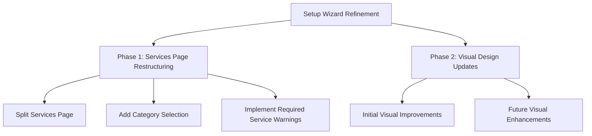
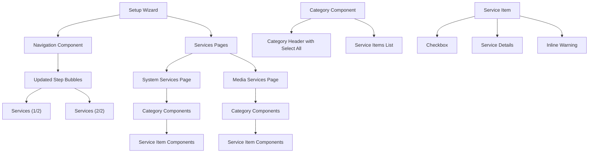
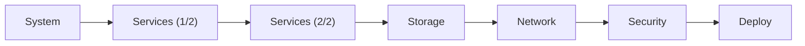
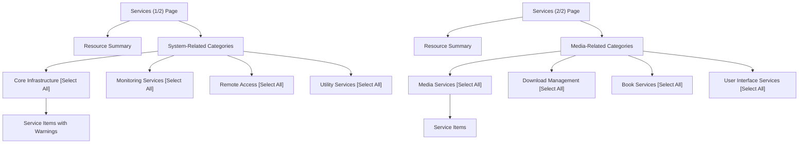

# Setup Wizard Refinement Plan

## Overview

This document outlines the plan for refining the setup wizard's services page and implementing visual design improvements. The plan addresses issues of clutter, navigation difficulty, adds category selection functionality, and incorporates a phased approach to visual design updates.



## Phase 1: Services Page Restructuring

### 1.1 Split Services Page into Two Pages

We'll divide the current services page into two separate pages:

1. **System-Related Services (Services 1/2)**
   - Core Infrastructure
   - Monitoring Services
   - Remote Access
   - Utility Services

2. **Media-Related Services (Services 2/2)**
   - Media Services
   - Download Management
   - Book Services
   - User Interface Services

### 1.2 Navigation Improvements

- Update the menu bubbles to show "Services (1/2)" and "Services (2/2)" instead of just "Services"
- Add clear navigation between the two services pages
- Maintain the existing step progression logic

### 1.3 Category Selection Feature

- Add a "Select All" button next to each category header
- When clicked, it will select/deselect all services within that category
- Include visual feedback when all items in a category are selected

### 1.4 Required Services Handling

- Allow users to deselect required core services
- Display inline warning messages when a required service is deselected
- Include information about potential issues if required services are not installed

## Phase 2: Visual Design Updates

### 2.1 Initial Visual Improvements (Current Implementation)

We'll implement core visual changes that align with the design guide while maintaining compatibility with the existing wizard:

1. **Color Updates**
   - Apply the primary accent colors from the design guide to key interactive elements
   - Update background colors to match the specified neutral palette
   - Implement consistent use of greyscale for text and secondary elements

2. **Typography Refinements**
   - Update fonts to use the specified sans-serif, geometric style
   - Apply uppercase styling to headers and lowercase to body text
   - Implement the three-tier type hierarchy

3. **Layout Enhancements**
   - Increase white space around key elements
   - Improve alignment and grid structure
   - Enhance visual hierarchy of elements

4. **Theme Consistency Improvements**
    - Replace hardcoded colors with theme variables throughout the UI
    - Ensure all UI elements properly adapt to both light and dark modes
    - Fix styling issues in resource summaries, accordions, and form elements
    - Update storage bars and toggle switches to respect theme settings

### 2.2 Future Visual Enhancements (Planned for Later)

These improvements will be documented for implementation in a future update:

1. **Comprehensive Component Redesign**
   - Standardize all UI components according to the design guide
   - Create a component library for consistent implementation

2. **Advanced Interaction Patterns**
   - Implement enhanced feedback mechanisms
   - Refine notification system
   - Optimize user flows for minimal clicks

3. **Full Accessibility Implementation**
   - Ensure WCAG compliance throughout
   - Implement scalable text and improved contrast
   - Add comprehensive keyboard navigation

## Implementation Details

### UI Component Structure



### Navigation Flow



### Services Page Layout



## Implementation Steps

### Phase 1: Services Page Restructuring

1. **Update Navigation Component**
   - Modify the step bubbles to show "Services (1/2)" and "Services (2/2)"
   - Update navigation logic to handle the split services pages

2. **Create System Services Page**
   - Implement the first services page with system-related categories
   - Add "Select All" buttons next to each category header
   - Implement inline warning system for required services

3. **Create Media Services Page**
   - Implement the second services page with media-related categories
   - Add "Select All" buttons next to each category header
   - Maintain consistent UI with the system services page

4. **Enhance Service Item Components**
   - Simplify the service item display
   - Add inline warning functionality for required services
   - Improve visual feedback for selection states

5. **Update Data Management**
   - Update the data flow to handle the split services pages
   - Ensure service selections are properly saved and passed between pages

### Phase 2: Visual Design Updates

1. **Initial Color Implementation**
   - Update primary buttons to use Pantone Blue 2995 C (#00AEEF)
   - Apply Pantone Green 3395 C (#00B398) for success states
   - Use Pantone Yellow 012 C (#FFD700) for warnings
   - Implement Pantone Warm Red C (#F93822) for errors/alerts
   - Update background to #F5F5F5
   - Apply secondary background (#CCCCCC at 10% opacity) for panels

2. **Typography Updates**
   - Update font styles to sans-serif, geometric
   - Apply uppercase styling to headers
   - Ensure consistent spacing and line heights

3. **Layout Refinements**
   - Increase white space around key elements
   - Improve alignment of form elements
   - Enhance visual hierarchy through spacing and sizing

4. **Theme Consistency Fixes**
    - Update resource summary backgrounds and borders to use theme variables
    - Fix accordion headers and borders to use theme variables
    - Update "Select All" button styling to adapt to dark mode
    - Fix storage bar backgrounds to use theme variables
    - Update toggle switch slider backgrounds to use theme variables
    - Test dark/light mode toggle functionality across all pages

4. **Document Future Enhancements**
   - Create a roadmap for comprehensive visual updates
   - Document component specifications for future implementation
   - Outline accessibility improvements for later phases

## Technical Implementation Details

### React Component Structure

```jsx
// Navigation Component with Updated Step Bubbles
const SetupWizardNavigation = ({ activeStep }) => {
  const steps = [
    { label: 'System', path: '' },
    { label: 'Services (1/2)', path: 'services-system' },
    { label: 'Services (2/2)', path: 'services-media' },
    { label: 'Storage', path: 'storage' },
    { label: 'Network', path: 'network' },
    { label: 'Security', path: 'security' },
    { label: 'Deploy', path: 'review' }
  ];
  
  return (
    <div className="stepper">
      {steps.map((step, index) => (
        <StepBubble
          key={step.label}
          completed={index < activeStep}
          active={index === activeStep}
        >
          {step.label}
        </StepBubble>
      ))}
    </div>
  );
};

// Category Component with Select All Button
const ServiceCategory = ({ title, services, onSelectAll, onChange }) => {
  return (
    <div className="accordion">
      <div className="accordion-header">
        {title}
        <button className="select-all-btn" onClick={onSelectAll}>Select All</button>
      </div>
      <div className="accordion-content">
        <div className="service-list">
          {services.map(service => (
            <ServiceItem 
              key={service.id}
              service={service}
              onChange={onChange}
            />
          ))}
        </div>
      </div>
    </div>
  );
};

// Service Item with Inline Warning
const ServiceItem = ({ service, onChange }) => {
  const [checked, setChecked] = useState(service.selected);
  const [showWarning, setShowWarning] = useState(false);
  
  const handleChange = (e) => {
    const isChecked = e.target.checked;
    setChecked(isChecked);
    
    // Show warning if unchecking a required service
    if (service.required && !isChecked) {
      setShowWarning(true);
    } else {
      setShowWarning(false);
    }
    
    onChange(service.id, isChecked);
  };
  
  return (
    <div className="service-item">
      <input 
        type="checkbox" 
        className="checkbox" 
        checked={checked}
        onChange={handleChange}
      />
      <div className="service-item-content">
        <div className="service-name">{service.name}</div>
        <div className="service-desc">{service.description}</div>
        
        {showWarning && (
          <div className="service-warning">
            WARNING: This is a required service. Not installing it may 
            cause issues with {service.warningDetails}.
          </div>
        )}
      </div>
      {service.required && <span className="chip chip-required">Required</span>}
      {service.hasDependencies && <span className="chip chip-dependency">Has Dependencies</span>}
      {service.securityInfo && <span className="chip chip-security">Security Info</span>}
    </div>
  );
};
```

### CSS Updates (Phase 1)

```css
/* Updated styles for the split services pages */
.stepper {
  display: flex;
  justify-content: space-between;
  margin: 2rem 0;
  padding: 0 1rem;
  gap: 1rem;
}

.step {
  background: #e0e0e0;
  color: #666;
  padding: 0.5rem 0;
  border-radius: 100px;
  font-size: 0.875rem;
  font-weight: 500;
  width: 120px;
  text-align: center;
  display: flex;
  align-items: center;
  justify-content: center;
}

/* Select All button styles */
.select-all-btn {
  background: #f5f5f5;
  border: 1px solid #ddd;
  border-radius: 4px;
  padding: 0.25rem 0.5rem;
  font-size: 0.75rem;
  margin-left: 1rem;
  cursor: pointer;
}

.select-all-btn:hover {
  background: #e0e0e0;
}

/* Inline warning styles */
.service-warning {
  background: #fff3e0;
  border-left: 4px solid #ff9800;
  padding: 0.75rem;
  margin-top: 0.5rem;
  font-size: 0.75rem;
  color: #e65100;
  border-radius: 0 4px 4px 0;
}
```

### CSS Updates (Phase 2 - Initial Visual Improvements)

```css
/* Color palette from design guide */
:root {
  --primary-blue: #00AEEF;
  --primary-green: #00B398;
  --primary-yellow: #FFD700;
  --primary-red: #F93822;
  --background-primary: #F5F5F5;
  --background-secondary: rgba(204, 204, 204, 0.1);
  --text-dark: #333333;
  --text-medium: #666666;
  --text-light: #999999;
}

body {
  background-color: var(--background-primary);
  font-family: 'SF Pro', 'Roboto', sans-serif;
  color: var(--text-dark);
}

.container {
  max-width: 1200px;
  margin: 2rem auto;
  padding: 0 1rem;
}

.paper {
  background: white;
  border-radius: 8px;
  box-shadow: 0 1px 3px rgba(0,0,0,0.12);
   padding: 2rem;
}

/* Updated to use theme variables */
.paper {
   background: var(--surface);
   border-radius: 8px;
   box-shadow: 0 1px 3px rgba(0,0,0,0.2);
   transition: var(--theme-transition);
  padding: 2rem;
}

h1, h2 {
  text-transform: uppercase;
  letter-spacing: 0.05em;
}

.btn-primary {
  background: var(--primary-blue);
  color: white;
}

.chip-required {
  background: var(--primary-blue);
}

.chip-dependency {
  background: var(--primary-yellow);
  color: var(--text-dark);
}

.chip-security {
  background: var(--primary-green);
}

.service-warning {
  background: var(--background-secondary);
  border-left: 4px solid var(--primary-yellow);
  color: var(--text-dark);
}

/* Dark/Light Theme Variables */
:root {
    /* Light Theme Colors */
    --light-primary-blue: #00AEEF;
    --light-primary-green: #00B398;
    --light-primary-yellow: #FFD700;
    --light-primary-red: #F93822;
    --light-background-primary: #F5F5F5;
    --light-background-secondary: rgba(204, 204, 204, 0.1);
    --light-surface: #FFFFFF;
    --light-border: #e0e0e0;
    --light-text-dark: #333333;
    --light-text-medium: #666666;
    --light-text-light: #999999;
    
    /* Dark Theme Colors */
    --dark-primary-blue: #33BEFF;
    --dark-primary-green: #33C5B0;
    --dark-primary-yellow: #FFDF33;
    --dark-primary-red: #FF6347;
    --dark-background-primary: #121212;
    --dark-background-secondary: rgba(255, 255, 255, 0.05);
    --dark-surface: #1E1E1E;
    --dark-border: #444444;
    --dark-text-dark: #FFFFFF;
    --dark-text-medium: #DDDDDD;
    --dark-text-light: #888888;
}
```

## Benefits of the New Approach

- **Reduced Complexity**: By splitting the services into two pages and organizing by type, users can more easily focus on the services they need
- **Improved Usability**: The "Select All" buttons make it faster to select or deselect entire categories
- **Better Flexibility**: Users can now deselect required services if they've already installed them
- **Enhanced Safety**: Inline warning messages ensure users understand the implications of not installing required services
- **Clearer Organization**: Grouping by system vs. media services creates a more logical flow
- **Visual Consistency**: The phased approach to visual design updates ensures a cohesive look while allowing for incremental improvements
- **Theme Adaptability**: All UI elements now properly adapt to both light and dark modes, ensuring readability and consistent appearance
- **Future-Proof Design**: By documenting future enhancements, we establish a clear path for ongoing visual refinements

## Next Steps

After approval of this plan, we'll proceed with implementation in the following order:

1. Split the services page and implement category selection functionality
2. Add inline warnings for required services
3. Apply initial visual design updates
4. Implement dark/light mode theme consistency ✅
5. Document future visual enhancements for later phases